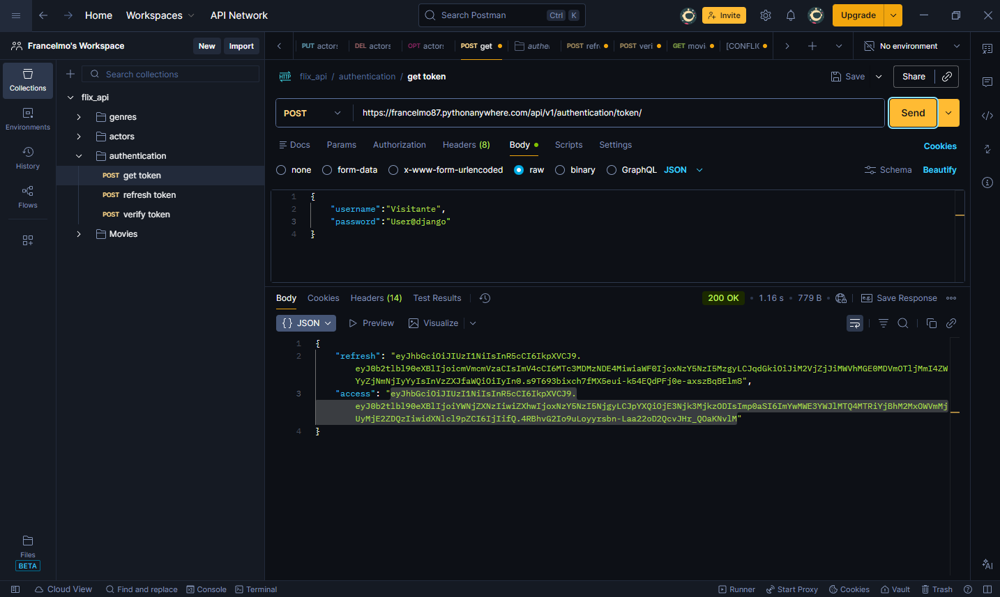
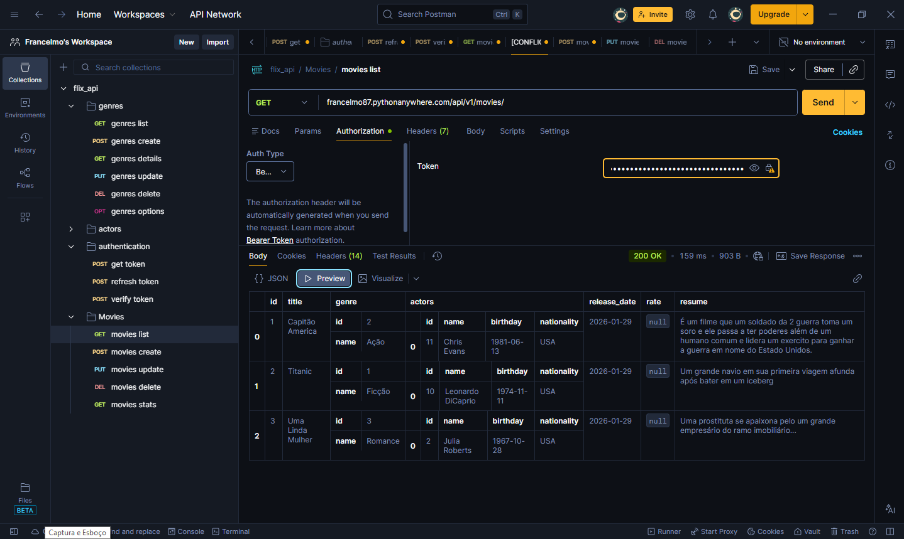
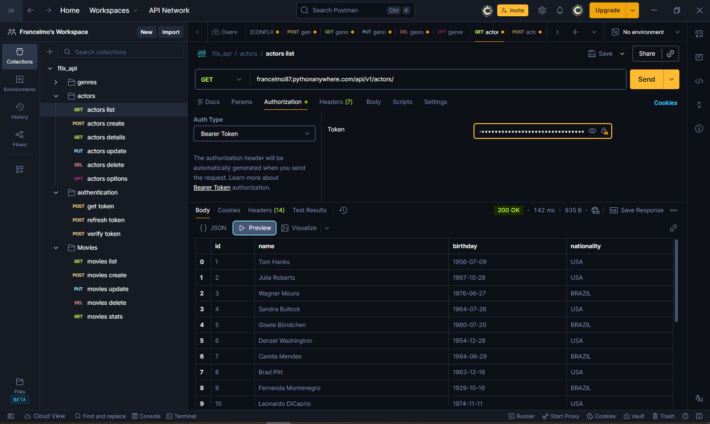

# 🎬 MovieVerse API

[](https://www.python.org/)
[](https://www.djangoproject.com/)
[](https://www.django-rest-framework.org/)
[](/LICENSE)

API REST para gerenciamento de filmes, gêneros, atores e avaliações, desenvolvida com **Django REST Framework**.
Projeto focado em boas práticas de backend, autenticação JWT e arquitetura RESTful — ideal para portfólio profissional.

---

## 🚀 Tecnologias Utilizadas

* **Python 3.11**
* **Django 5**
* **Django REST Framework (DRF)**
* **JWT Authentication (SimpleJWT)**
* **SQLite** (pode ser facilmente adaptado para PostgreSQL)

---

## ✨ Funcionalidades

* CRUD completo de **Filmes**, **Gêneros** e **Atores**
* Sistema de **avaliações com estrelas**
* Relacionamentos Many-to-Many
* Autenticação e autorização com **JWT**
* Versionamento de API

---

## 📁 Estrutura do Projeto

```text
flix_api_drf/
│── actors/
│── genres/
│── movies/
│── reviews/
│── authentication/
│── core/
│── manage.py
```

---

## 🛠️ Instalação e Execução

### 1️⃣ Clone o repositório

```bash
git clone https://github.com/Francelmo87/flix_api_drf.git
cd flix_api_drf
```

### 2️⃣ Crie e ative o ambiente virtual

```bash
python -m venv .venv
source .venv/bin/activate  # Linux / WSL
.venv\Scripts\activate     # Windows
```

### 3️⃣ Instale as dependências

```bash
pip install -r requirements.txt
```

### 4️⃣ Configure o ambiente

```bash
python env_gen.py
```

### 5️⃣ Migrações e servidor

```bash
python manage.py migrate
python manage.py runserver
```

A API está publicada e disponível para testes em produção:

🔗 https://francelmo87.pythonanywhere.com

---

## 🔐 Autenticação

A API utiliza **JWT** para autenticação.

### Gerar token

```http
POST francelmo87.pythonanywhere.com/api/v1/authentication/token/
Username: Visitante
Password: User@django
```

### Atualizar token

```http
POST francelmo87.pythonanywhere.com/api/v1/authentication/token/refresh/
```

---

## 📌 Principais Endpoints

| Método | Endpoint           | Descrição      |
| ------ | ------------------ | -------------- |
| GET    | `francelmo87.pythonanywhere.com/api/v1/movies/`  | Lista filmes   |
| POST   | `francelmo87.pythonanywhere.com/api/v1/movies/`  | Cria um filme  |
| GET    | `francelmo87.pythonanywhere.com/api/v1/genres/`  | Lista gêneros  |
| POST   | `francelmo87.pythonanywhere.com/api/v1/genres/`  | Cria gêneros   |
| GET    | `francelmo87.pythonanywhere.com/api/v1/actors/`  | Lista atores   |
| POST   | `francelmo87.pythonanywhere.com/api/v1/actors/`  | Cria atores    |
| POST   | `francelmo87.pythonanywhere.com/api/v1/reviews/` | Cria avaliação |

---
## Usuários e Grupos

Nesse sistema foi criados dois grupos de permissões
1. Admin_user -> Faz todas as requisições em todos os endpoints do sistema(GET, POST, PATCHE, PUT, DELETE)
2. regular_user -> Faz apenas as visualizações dos endpoints(GET)

## 📸 Demonstração da API (Postman)

### 🔐 Autenticação JWT


### 🎬 Listagem de Filmes


### 🎬 Listagem de Atores



## 🎯 Objetivo do Projeto

Este projeto foi desenvolvido para consolidar conhecimentos em:

* Django REST Framework
* APIs RESTful
* Autenticação JWT
* Boas práticas de backend

---

## 📫 Contato

**Francelmo Sousa da Silva**
🔗 GitHub: [https://github.com/Francelmo87](https://github.com/Francelmo87)

---

⭐ Se este projeto te ajudou ou chamou atenção, considere deixar uma estrela!
